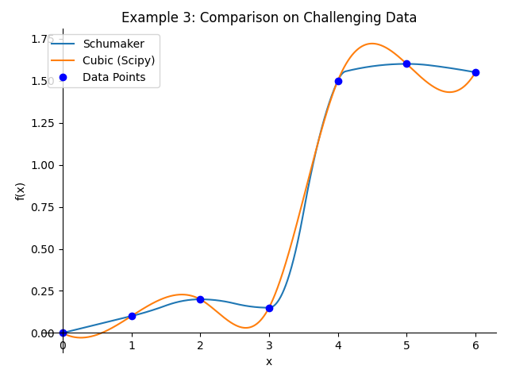

# Shumaker spline

This is an implementation of the Shumaker spline in Python.

The Shumaker spline is a piecewise quadratic spline that is *co-monotone* and *co-convex* with respect to the data. This is very important when we want a shape-preserving interpolation. Other standard methods, like the canonical cubic splines (found in e.g., Scipy), do not guarantee this, as can be seen below.



I couldn't find an implementation in Python (though there is an R package). The original reference is Schumaker, L.L. 1983. On shape-preserving quadratic spline interpolation. SIAM Journal of Numerical Analysis 20: 854-64. My implementation follows the exposition in the book: Judd KL. Numerical methods in economics. MIT press; 1998 Sep 28.

It is all in one file, `shumaker_spline.py`, in one function `shumaker_spline()`. You can just put the file into your project or just copy the code into your codebase, its only about 100 lines total.

## Dependencies

To use the function, you need `numpy` and `sympy`. To optionally run the examples (`examples.py`) you also need `scipy` and `matplotlib`.

## Usage

Simply pass your $x$-coordinates and $y$-coordinates to the `shumaker_spline()` function.

```python
from shumaker_spline import shumaker_spline
import numpy as np

# Example Data
x = np.array([0, 1, 2, 3, 4, 5, 6])
y = np.array([0, 0.1, 0.2, 0.15, 1.5, 1.6, 1.55])

print(shumaker_spline(x, y))
```

By default, it will return a 1D array of x-coordinates and a 2D array of coefficients.

```python
knots, coeffs = shumaker_spline(x, y)
```

The Shumaker algorithm may insert additional x-coordinate values within the given data in order to create the appropriate quadratic splines. So, the final returned `knots`, which contains the original x-coordinates and the additional ones inserted by the algorithm, has length greater or equal to the original array of points `x`.

Let $N$ be the length of `knots`. Then, `coeffs` has shape $(N-1, 3)$. The $i$th row of `coeffs` contains coefficients $[a,b,c]$ for the quadratic segment over the interval from `knots[i]` to `knots[i+1]`. The form of the quadratic is $a + b(x-t) + c(x-t)^2$, where $t$ is equal to `knots[i]`, and $[a,b,c]$ is equal to `coeffs[i]`.

Perhaps more useful is to ask it to return the full spline as a SymPy Piecewise object.

```python
spline = shumaker_spline(x, y, return_type='sympy')
print(spline)
```

This object contains the quadratic expression and the intervals, for the entire spline. And it can be easily evaluated using `.subs()` or plotted with `.plot()` from SymPy.

Optionally, one can also provide data for the slopes at each data point, with the `s` argument. If slopes are provided, this is called "Hermite data". Without slopes, it is called "Lagrangian data". The first step that the function does in the case of Lagrangain data is to estiamte the slopes. If Hermite data is given, then we skip this step and start constructing the spline.

## Examples

See `example.py` for detailed usage examples, including:
1.  Basic spline generation and plotting for simple monotonic data.
2.  Visualizing the original data points alongside *all* knots (including inserted ones) used by the spline.
3.  Comparing the Shumaker spline with a standard `scipy.interpolate.CubicSpline` on challenging data to highlight the shape-preserving benefits (e.g., avoiding overshoot).

The example script generates multiple plots to illustrate these points.

